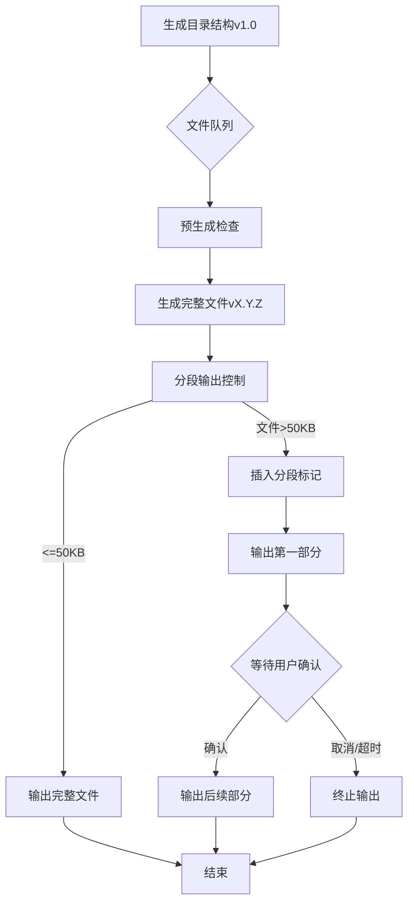

# WooCommerce多站点支付优化项目开发规范（增强版）

 **一、核心开发基准**  
   - 技术栈要求  
   - 架构约束  
**二、开发流程规范**  
   - 文件生成流程（Mermaid 流程图）  
   - 质量控制矩阵  
**三、异常熔断机制**  
   - 立即中止的情形（代码示例）  
**四、智能分段系统**  
   - 文件切割规则  
   - 分段标记格式  
**五、版本控制体系**  
   - 三元版本号规则  
   - 版本清单示例  
**六、特别安全条款**  
   - 跨站请求伪造（CSRF）防御  
   - 多站点数据隔离（SQL 设计）  
**七、性能保障承诺**  
   - 资源消耗上限（内存、SQL 查询、执行时间）  
   - 优化补偿机制  


## 一、核心开发基准
**技术栈要求：**
- PHP 8.0+（严格类型声明，需添加 `declare(strict_types=1)`）
- WordPress 6.7.2+（多站点模式，需验证子域名/子目录兼容性）https://github.com/WordPress/WordPress/tags
- WooCommerce 9.7+（REST API v3，适配 `WC_Webhook::set_delivery_url()`）https://github.com/woocommerce/woocommerce/releases
- MariaDB 10.0+（InnoDB引擎，强制 `_site_id` 字段索引）

**架构约束：**
```text
严禁修改以下核心组件：
▢ wp-content/plugins/woocommerce/
▢ wp-includes/rest-api/
可扩展区域：
▢ 自定义支付网关（必须继承WC_Payment_Gateway）
▢ 多站点结算服务（独立数据库表）
```

**SDK 集成要求：**
所有支付集成功能必须使用官方 SDK 进行开发，不得直接调用 API。
- **微信支付：** 使用 `wechatpay-php`（https://github.com/wechatpay-apiv3/wechatpay-php）
- **支付宝支付：** 使用 `alipay-sdk-php`（https://github.com/alipay/alipay-sdk-php-all）

## 二、开发流程规范
### 文件生成流程


## 三、异常熔断机制
**立即中止的情形（示例）：**
```php
// 危险模式检测
if (
    function_exists('wc_get_payment_gateways') &&
    !has_filter('woocommerce_payment_gateways')
) {
    throw new MultisitePaymentException(
        'WC支付网关初始化钩子丢失',
        self::ERR_CODE_HOOK_CONFLICT
    );
}
```

## 四、智能分段系统
**文件切割规则：**
```text
[分段策略]
1. 每段 ≤ 50行 或 ≤ 50KB
2. 切割点优先级：
   1) 类/接口定义结束
   2) 方法结束
   3) 闭合标签前
```

## 五、版本控制体系
**三元版本号规则：**
```text
主版本.特性版本.修订版本（例：2.1.15）
```

## 六、特别安全条款
**必须包含的防御措施：**
1. **跨站请求伪造（CSRF）防御：**
   ```php
   add_action('wc_ajax_custom_refund', function() {
       check_ajax_referer('multisite-refund-nonce', 'security');
   });
   ```
2. **多站点数据隔离：**
   ```sql
   CREATE TABLE wp_multisite_payments (
       blog_id BIGINT(20) NOT NULL,
       payment_id VARCHAR(36) NOT NULL,
       INDEX blog_payment_idx (blog_id, payment_id)
   ) ENGINE=InnoDB DEFAULT CHARSET=utf8mb4;
   ```
3. **动态IP白名单：**  
   ```php
   // 定期拉取微信/支付宝官方IP段
   $wechat_ips = wp_remote_get('https://api.mch.weixin.qq.com/risk/getprotectedip');
   if (!in_array($_SERVER['REMOTE_ADDR'], json_decode($wechat_ips))) {
       wp_die("非法IP来源", 403);
   }
   ```

4. **密钥加密存储：**  
   ```php
   // 使用 WordPress Salt 动态加密
   $encrypted_key = openssl_encrypt($raw_key, 'AES-256-CBC', wp_salt());
   update_network_option(null, 'wechat_api_key', $encrypted_key);
   ```

## 七、性能保障承诺
**资源消耗上限：**
| 指标 | 普通请求 | 管理后台 |
|------|---------|---------|
| 内存峰值 | ≤32MB | ≤64MB |
| SQL查询数 | ≤12次 | ≤25次 |
| 执行时间 | ≤800ms | ≤1500ms |

**优化补偿机制：**
当检测到超限时自动执行：
1. 查询结果缓存（WP Object Cache）
2. 延迟加载非核心资源
3. 批量处理队列化

