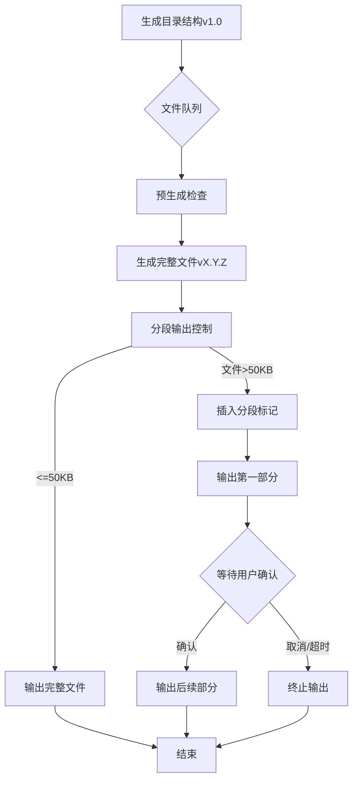

# WooCommerce多站点支付优化项目开发规范（增强版）

## 一、核心开发基准
**技术栈要求：**
- PHP 7.4+（严格类型声明）
- WordPress 5.8+（多站点模式）
- WooCommerce 5.5+（REST API v3）
- MySQL 8.0+（InnoDB引擎）

**架构约束：**
```text
严禁修改以下核心组件：
▢ wp-content/plugins/woocommerce/
▢ wp-includes/rest-api/
可扩展区域：
▢ 自定义支付网关（必须继承WC_Payment_Gateway）
▢ 多站点结算服务（独立数据库表）
```

## 二、开发流程规范
### 文件生成流程



    
### 质量控制矩阵
| 检测阶段 | 检测项 | 执行方式 |
|---------|--------|---------|
| 生成前   | 1. 命名规范检查<br>2. 钩子冲突扫描<br>3. SQL注入预防 | 静态分析 |
| 生成中   | 1. 上下文一致性<br>2. 版本依赖解析 | 动态追踪 |
| 生成后   | 1. 跨文件影响评估<br>2. 性能基线测试 | 模拟沙盒 |

## 三、异常熔断机制
**立即中止的情形（示例）：**
```php
// 危险模式检测
if (
    function_exists('wc_get_payment_gateways') && 
    !has_filter('woocommerce_payment_gateways')
) {
    throw new MultisitePaymentException(
        'WC支付网关初始化钩子丢失',
        self::ERR_CODE_HOOK_CONFLICT
    );
}
```

## 四、智能分段系统
**文件切割规则：**
```text
[分段策略]
1. 每段 ≤ 50行 或 ≤ 50KB
2. 切割点优先级：
   1) 类/接口定义结束
   2) 方法结束
   3) 闭合标签前

[标记格式]
// ====== FILE: class-payment-controller.php (v1.2.3) PART 1/3 ======
...代码内容...
// ====== END PART 1/3 - 回复"CONTINUE_2345"获取下段 ======
```

## 五、版本控制体系
**三元版本号规则：**
```text
主版本.特性版本.修订版本（例：2.1.15）
更新逻辑：
- 目录结构调整 ⇒ 主版本+1
- 新增功能文件 ⇒ 特性版本+1 
- 代码优化/修正 ⇒ 修订版本+1

版本清单示例：
├── v2.0 (目录基准版本)
│   ├── payment-gateway/v2.1.5
│   ├── refund-service/v1.0.2
│   └── multisite-db/v1.3.7
```

## 六、特别安全条款
**必须包含的防御措施：**
1. 跨站请求伪造（CSRF）防御：
   ```php
   add_action('wc_ajax_custom_refund', function() {
       check_ajax_referer('multisite-refund-nonce', 'security');
       // 业务逻辑
   });
   ```
2. 多站点数据隔离：
   ```sql
   /* 所有自定义表必须包含blog_id字段 */
   CREATE TABLE wp_multisite_payments (
       blog_id BIGINT(20) NOT NULL,
       payment_id VARCHAR(36) NOT NULL,
       INDEX blog_payment_idx (blog_id, payment_id)
   ) ENGINE=InnoDB DEFAULT CHARSET=utf8mb4;
   ```

## 七、性能保障承诺
**资源消耗上限：**
| 指标 | 普通请求 | 管理后台 | 
|------|---------|---------|
| 内存峰值 | ≤32MB | ≤64MB |
| SQL查询数 | ≤12次 | ≤25次 |
| 执行时间 | ≤800ms | ≤1500ms |

**优化补偿机制：**
当检测到超限时自动执行：
1. 查询结果缓存（WP Object Cache）
2. 延迟加载非核心资源
3. 批量处理队列化

